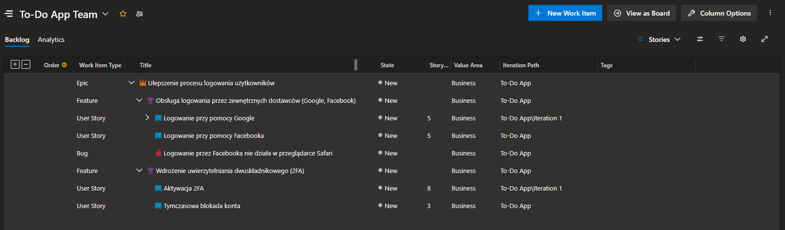

# Organizacja pracy w projekcie

## Backlog

### Czym jest backlog? 

Backlog to lista wszystkich funkcjonalności, zadań i usprawnień, które mają zostać wykonane w projekcie.

W Azure DevOps backlog to po prostu zbiór Work Items (Epic, Feature, User Story, Task), które opisują wymagania i prace do wykonania w projekcie.

Backlog można podzielić na dwa poziomy:
* Product Backlog – wszystkie wymagania dla całego produktu (długoterminowe).
* Sprint Backlog – zestaw zadań wybranych do realizacji w jednym sprincie (krótkoterminowe).

### Po co jest backlog?

* Organizacja pracy
* Priorytetyzacja
* Śledzenie postępu
* Komunikacja w zespole
* Elastyczność

### Backlog na podstawie Azure DevOps

Lista elementów z polami:
- Typ (Epis, Feature, User story, Task)
- Tytuł
- Opis
- Kryteria akceptacji
- Status
- Priorytet
- Estymacja czasu (tzw. Story Points)
- Osoba odpowiedzialna
- Linki do innych elementów backlogu
- Linki do gałęzi (branch) w repozytorium
- Komentarze/dyskusja

## Typy elementów w backlogu

1. Epic (Epik)

    Największy poziom abstrakcji, reprezentuje szeroki obszar funkcjonalny lub cel biznesowy.

    Przykład:

    📌 Tytuł: Ulepszenie bezpieczeństwa aplikacji

    📌 Opis: W celu zwiększenia ochrony danych użytkowników i zgodności z RODO dodajemy szyfrowanie haseł oraz logowanie dwuskładnikowe.

    📌 Kryteria akceptacji:

    ✅ Hasła przechowywane w formie zaszyfrowanej

    ✅ Obsługa uwierzytelniania dwuetapowego

    ✅ Możliwość zmiany hasła przez użytkownika

2. Feature (Funkcja)

    Średni poziom abstrakcji. Feature reprezentuje większą funkcjonalność w ramach Epic i składa się z User Stories.

    Przykład:

    📌 Tytuł: Obsługa dwuskładnikowego uwierzytelniania

    📌 Opis: Aby zwiększyć bezpieczeństwo użytkowników, dodajemy możliwość aktywacji logowania dwuetapowego przy użyciu kodów SMS lub aplikacji Authenticator.

    📌 Kryteria akceptacji:

    ✅ Użytkownik może włączyć dwuskładnikowe uwierzytelnianie w ustawieniach

    ✅ Kod weryfikacyjny jest wysyłany na telefon lub generowany przez aplikację

    ✅ Po trzech błędnych próbach logowania konto jest blokowane

3. User Story (Historia użytkownika)

    Reprezentuje konkretne wymaganie użytkownika – jest to najmniejsza jednostka backlogu zawierająca pojedynczą funkcjonalność. Powinna być na tyle mała, aby mogła zostać ukończona w jednym sprincie. Często jej format to: **Jako [ktoś] chcę [coś], aby [coś]**.

    Przykład:

    📌 Tytuł: Jako użytkownik chcę włączyć logowanie dwuetapowe, aby zwiększyć bezpieczeństwo mojego konta

    📌 Opis: Po aktywacji użytkownik musi potwierdzić tożsamość przy logowaniu, wpisując kod SMS lub z aplikacji Authenticator.

    📌 Kryteria akceptacji:

    ✅ W ustawieniach dostępna jest opcja „Włącz dwuskładnikowe uwierzytelnianie”

    ✅ Po aktywacji użytkownik musi wybrać metodę: SMS lub Authenticator

    ✅ Przy każdym logowaniu użytkownik musi podać kod

4. Task (Zadanie)

    Reprezentuje konkretną pracę do wykonania w ramach User Story. Może to być kodowanie, testowanie, projektowanie UI itp.

    Przykład:

    📌 Tytuł: Zaimplementować mechanizm wysyłania kodów SMS

    📌 Opis: Utworzyć API do wysyłki kodów na telefon użytkownika przy logowaniu. Skorzystać z zewnętrznego dostawcy usług SMS.

    📌 Status: W toku

    📌 Przypisany do: Jan Kowalski

## Przykładowy backlog

Proces w Azure DevOps: `Agile`

## Jak pisać dobre User Story?

Zasada **INVEST** to świetna praktyka, która pomaga w tworzeniu dobrych User Stories w backlogu.

1. I – Independent (Niezależna)

    * Historia użytkownika powinna być możliwie samodzielna, aby można było ją realizować bez zależności od innych zadań.

    * Jeśli jedna User Story blokuje inną, może to powodować opóźnienia w realizacji sprintu.

    * ❌ Złe: „Użytkownik może zresetować hasło” (jeśli logowanie nie jest gotowe, nie można tego wdrożyć).

    * ✅ Dobre: „Użytkownik może otrzymać e-mail z linkiem do resetu hasła” (to można wdrożyć osobno).

2. N – Negotiable (Negocjowalna)

    * User Story nie jest sztywną specyfikacją, ale punktem do rozmów między zespołem a Product Ownerem.

    Szczegóły mogą się zmieniać w trakcie planowania.

    * ✅ Dobre: „Użytkownik powinien widzieć listę swoich zadań” – sposób realizacji (np. jako tabela czy lista kart) może być ustalony 
    później.

3. V – Valuable (Wartościowa)

    * Każda historia powinna przynosić wartość dla użytkownika lub klienta.

    * Jeśli User Story nie daje wartości, nie powinna znaleźć się w backlogu.

    * ❌ Złe: „Zmienimy kolor przycisku na niebieski” – jeśli to nie wpływa na UX, nie ma wartości.

    * ✅ Dobre: „Użytkownik może filtrować swoje zadania po statusie” – daje realną wartość.

4. E – Estimable (Estymowalna)

    * Powinna być na tyle szczegółowa, aby dało się oszacować czas pracy.

    * Jeśli nie można jej oszacować, to prawdopodobnie jest za duża i trzeba ją podzielić na mniejsze części.

    * ❌ Złe: „Dodanie nowego systemu raportowania” – zbyt szerokie, trudne do oszacowania.

    * ✅ Dobre: „Użytkownik może wygenerować raport PDF z zadaniami” – konkretny zakres.

5. S – Small (Mała)

    * Powinna być na tyle mała, żeby można było ją ukończyć w jednym sprincie (najlepiej w ciągu 1-3 dni).

    Jeśli historia jest zbyt duża, podziel ją na mniejsze User Stories.

    * ❌ Złe: „Jako użytkownik chcę pełną personalizację ustawień aplikacji” – za duże.

    * ✅ Dobre: „Jako użytkownik chcę zmienić język aplikacji w ustawieniach” – małe i konkretne.

6. T – Testable (Testowalna)

    * Powinna mieć jasne kryteria akceptacji, które pozwalają sprawdzić, czy działa poprawnie.

    Jeśli nie można przetestować historii, to jest źle sformułowana.

    * ❌ Złe: „Użytkownik powinien mieć lepsze doświadczenie logowania” – niejasne, nie da się przetestować.

    * ✅ Dobre: „Po trzech błędnych próbach logowania użytkownik widzi komunikat o blokadzie” – można sprawdzić.

## Przykład dobrej User Story z **INVEST**

Tytuł: Jako użytkownik chcę otrzymywać e-mail z linkiem do resetu hasła, aby móc odzyskać dostęp do konta.

✅ Independent (Niezależna) – Można wdrożyć reset hasła osobno, bez czekania na inne funkcje.

✅ Negotiable (Negocjowalna) – Możemy negocjować szczegóły implementacji, np. sposób generowania linku do resetu hasła (czas trwania ważności linku, liczba prób, itp.).

✅ Valuable (Wartościowa) – Użytkownik nie straci konta, jeśli zapomni hasła.

✅ Estimable (Estymowalna) – Możemy oszacować pracę (np. 3 dni).

✅ Small (Mała) – Jest to jedno konkretne zadanie.

✅ Testable (Testowalna) – Możemy sprawdzić, czy e-mail faktycznie przychodzi.
