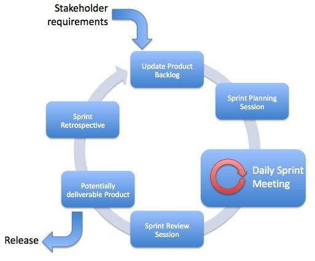
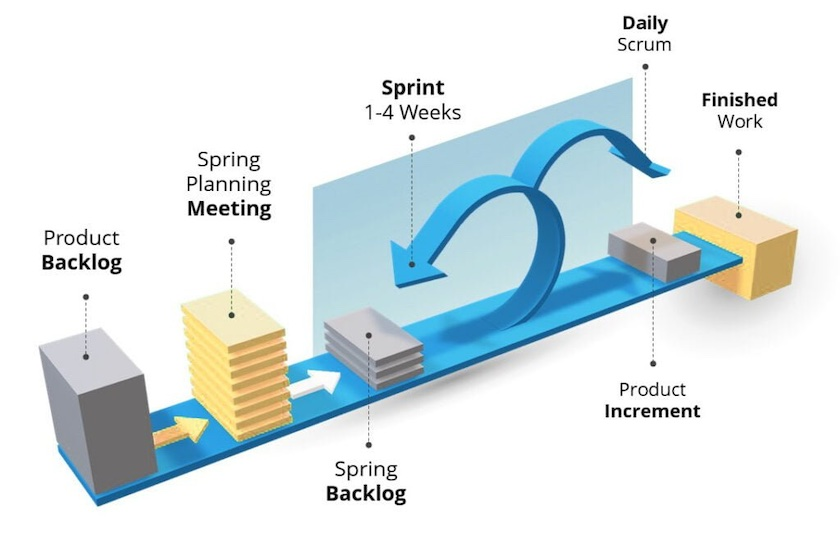

# Środowisko programistyczne

## Organizacja pracy w projekcie (część 2)

### Priorytetyzacja backlogu – metoda MoSCoW

Metoda MoSCoW pomaga zespołom określić priorytet zadań, dzieląc je na cztery kategorie:

* Must have (M) – absolutnie kluczowe wymagania, bez których projekt nie może zostać ukończony.

    Przykład: „System musi umożliwiać logowanie użytkowników.”

* Should have (S) – bardzo ważne, ale nie krytyczne; mogą być zrealizowane później, jeśli zabraknie czasu.

    Przykład: „Aplikacja powinna mieć możliwość logowania przez Google, ale może to być dodane po premierze.”

* Could have (C) – mile widziane dodatki, ale nie wpływają znacząco na główne funkcjonalności.

    Przykład: „Dodanie ciemnego motywu w interfejsie użytkownika.”

* Won't have (W) – funkcje, które nie będą realizowane w tym sprincie / wersji, ale mogą być brane pod uwagę w przyszłości.

    Przykład: „Obsługa wielu języków w pierwszej wersji aplikacji.”

### Story Points i estymacja pracy w sprincie

Story Points to jednostka miary złożoności i wysiłku wymaganego do wykonania zadania. Nie jest to liczba godzin, lecz względna trudność.

### Jak przydzielać zadania?
Podczas sprint planningu zespół przypisuje każdemu zadaniu Story Points, np. według skali Fibonacciego (1, 2, 3, 5, 8, 13...).

* 1-2 SP – proste zadania, np. „Dodanie nowego przycisku w UI.”

* 3-5 SP – średnie zadania, np. „Zaimplementowanie formularza logowania.”

* 8-13 SP – bardziej złożone zadania, np. „Stworzenie i integracja API do uwierzytelniania użytkowników.”

Uwaga!

Każdy członek zespołu ma ograniczoną liczbę Story Points, które może zrealizować w jednym sprincie.
Np. jeśli sprint trwa 2 tygodnie, a programista może średnio ukończyć 10 SP, to nie powinien dostawać więcej niż 10 SP na sprint.

### Sprint – jak wygląda praca w Scrum?



Sprint to ustalony czas (np. 1-2 tygodnie), w którym zespół realizuje zaplanowane zadania.

Przebieg sprintu:

* Sprint Planning – zaplanowanie zakresu pracy na sprint.

* Daily Stand-up – krótkie codzienne spotkania (15 min), każdy odpowiada na 3 pytania:

    * Co zrobiłem wczoraj?

    * Co zrobię dzisiaj?

    * Czy mam jakieś blokery?

* Sprint Review – podsumowanie prac, prezentacja wyników.

* Sprint Retrospective – analiza, co poszło dobrze, a co można poprawić.



### Role w Scrum

* Product Owner – osoba odpowiedzialna za backlog i priorytetyzację zadań.

    Dba o to, by zespół dostarczał wartość biznesową.

    Przykład: decyduje, czy dodać funkcję „logowania przez Facebook” w tym sprincie czy w przyszłym.

* Scrum Master – wspiera zespół, pomaga usuwać blokery, pilnuje zasad Scrum.

    Przykład: jeśli zespół ma problem z dostępem do serwera, Scrum Master pomaga znaleźć rozwiązanie.

* Development Team – programiści, testerzy, DevOps – osoby realizujące zadania w backlogu.

* Stakeholder / Client – osoby, które mają wpływ na produkt (np. klient, szef, inwestorzy).

## Środowiska wirtualne w Pythonie

Wirtualne środowiska w Pythonie pozwalają na izolację pakietów dla różnych projektów, dzięki czemu unikamy konfliktów zależności i problemów z różnymi wersjami bibliotek.

### Po co używać wirtualnych środowisk?

* Izolacja projektów – Każdy projekt ma swoje własne zależności, dzięki czemu nie ma konfliktów między różnymi wersjami pakietów.

* Bezpieczeństwo – Można testować nowe pakiety bez ryzyka uszkodzenia globalnego środowiska.
* Reprodukowalność – Można łatwo odtworzyć środowisko na innym komputerze.
* Elastyczność – Możliwość pracy z różnymi wersjami Pythona i bibliotek w tym samym systemie.

### Popularne narzędzia do zarządzania środowiskami
| Narzędzie   | Opis | Zalety | Wady |
|------------|------|--------|------|
| `venv` | Wbudowane narzędzie Pythona do tworzenia środowisk wirtualnych. | ✅ Wbudowane w Python, lekkie, proste | ❌ Brak zarządzania zależnościami i wersjami Pythona |
| `virtualenv` | Starsza alternatywa dla `venv`, działa z wieloma wersjami Pythona. | ✅ Szybsze niż `venv`, kompatybilne z `pip` | ❌ Nie zarządza wersjami Pythona |
| `pyenv` | Narzędzie do zarządzania wersjami Pythona. | ✅ Pozwala używać wielu wersji Pythona | ❌ Nie zarządza pakietami |
| `conda` | Zaawansowane narzędzie do zarządzania środowiskami i pakietami (głównie dla Data Science). | ✅ Instalacja skompilowanych pakietów, zarządza wersjami Pythona | ❌ Wymaga pobrania Minicondy lub Anacondy |
| `poetry` | Nowoczesne narzędzie do zarządzania zależnościami i środowiskami. | ✅ Automatyczne zarządzanie pakietami, świetne do aplikacji | ❌ Może być nadmiarowe dla prostych projektów |


#### Jak używać venv?

Tworzenie nowego środowiska:

```
python -m venv my_env
```

Aktywacja środowiska:

```
source my_env/bin/activate
```

Dezaktywacja środowiska:

```
deactivate
```

Instalowanie pakietów:

```
pip install numpy pandas
```

Zapisywanie zależności do pliku (requirements.txt)

```
pip list --format=freeze > requirements.txt
```

Odtworzenie środowiska na innym komputerze:

```
pip install -r requirements.txt
```

#### Jak używać Conda?

##### Miniconda vs Anaconda – jaka różnica?

| Cecha              | Miniconda | Anaconda |
|--------------------|----------|----------|
| **Rozmiar**       | 🔹 Małe (~50MB) | 🔹 Duże (~3GB) |
| **Domyślne pakiety** | 🚫 Brak pakietów | ✅ Zawiera pakiety (numpy, pandas, Jupyter itp.) |
| **Elastyczność**  | ✅ Instalujesz tylko to, czego potrzebujesz | ❌ Instaluje się dużo zbędnych rzeczy |
| **Licencja**      | ✅ Darmowa (w tym do użytku komercyjnego) | ❌ Wymaga licencji komercyjnej dla firm |

📌 Wniosek: Jeśli chcesz pełną kontrolę i minimalny rozmiar – używaj Minicondy. Jeśli chcesz gotowe środowisko do Data Science – wybierz Anacondę.

##### Tworzenie środowiska Conda

Tworzenie nowego środowiska:

```
conda create -n my_env python=3.9
```

Aktywacja środowiska:

```
conda activate my_env
```

Dezaktywacja środowiska:

```
conda deactivate
```

Usunięcie środowiska:

```
conda remove -n my_env --all
```

Instalowanie pakietów:

```
conda install numpy pandas
```

Dlaczego używać conda install zamiast pip install?

* Conda pobiera skompilowane pakiety → działa szybciej i eliminuje problemy z zależnościami.
* Może automatycznie dopasować wersje zależności (pip nie robi tego tak dobrze).
* pip instaluje pakiety z PyPI, a conda z własnych repozytoriów (np. conda-forge), co czasem prowadzi do konfliktów.

#### Jak zarządzać zależnościami?

##### requirements.txt (pip)

📌 Plik używany przez pip, zawiera listę pakietów do zainstalowania.

Przykład:

```
numpy==1.23.0
pandas>=1.5,<2.0
scikit-learn
```

##### environment.yml (conda)

📌 Plik konfiguracyjny do odtwarzania środowisk Conda.

```
name: my_env
dependencies:
  - python=3.9
  - numpy=1.23.0
  - pandas>=1.5,<2.0
  - pip
  - pip:
      - scikit-learn
```

Tworzenie środowiska z pliku:

```
conda env create -f environment.yml
```

Eksportowanie aktualnego środowiska do pliku:

```
conda env export > environment.yml
```

##### Dependency Hell – jak Conda rozwiązuje konflikty?

Conda automatycznie sprawdza zgodność wersji pakietów i jeśli nowy pakiet wymaga innej wersji już zainstalowanego pakietu, może go zaktualizować, obniżyć wersję lub usunąć.

Generowanie "planu działania" poprzez conda:

```
conda install tensorflow --dry-run
```

##### Podsumowanie

* venv – dobre do prostych projektów.

* Conda – najlepsze dla Data Science i ML.

* pyenv – jeśli musisz pracować z wieloma wersjami Pythona.

* poetry – nowoczesne zarządzanie pakietami dla aplikacji.

## Pierwsza aplikacja w Streamlit

* Przykładowa aplikacja znajduje się w folderze `sentiment_analysis`.

* Dokumentacja pakietu, elementów oraz przykładowe aplikacje dostępne na: [https://docs.streamlit.io/](https://docs.streamlit.io/)
