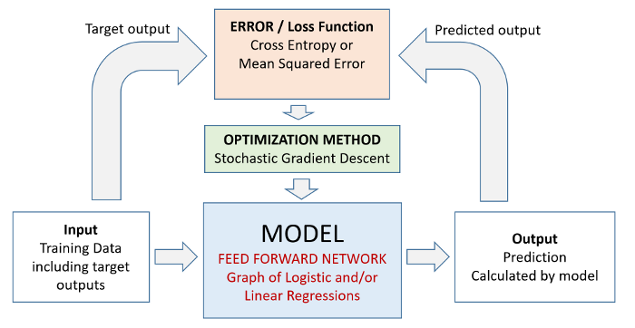

# Wstęp do sieci neuronowych

## Czym jest sieć neuronowa?

Sieć neuronowa to model matematyczny inspirowany budową ludzkiego mózgu. Składa się z neuronów, które przekazują sobie informacje, przekształcając wejściowe dane w użyteczne wyniki. Struktura sieci składa się z trzech głównych warstw:

- **Warstwa wejściowa** – przyjmuje dane wejściowe (np. piksele obrazu, cechy tekstu).
- **Warstwy ukryte** – przekształcają dane poprzez połączenia między neuronami.
- **Warstwa wyjściowa** – zwraca wynik (np. klasyfikacja obrazu jako "kot" lub "pies").

Dodatkowo, w celu wprowadzenia nieliniowości, po każdej warstwie stosuje się tzw. funkcję aktywacji.

## Funkcje aktywacji

Funkcje aktywacji decydują, jak przekształcane są sygnały przechodzące przez neurony. Oto najważniejsze z nich:

1. **Sigmoid** – przekształca wejście w zakres (0,1):
   
   $f(x) = \frac{1}{1 + e^{-x}}$

2. **ReLU (Rectified Linear Unit)** – najczęściej stosowana, zeruje wartości ujemne:
   
   $f(x) = \max(0, x)$

3. **Tanh** – podobna do sigmoid, ale zwraca wartości w zakresie (-1,1):
   
   $f(x) = \frac{e^x - e^{-x}}{e^x + e^{-x}}$

4. **Softmax** – stosowana w klasyfikacji wieloklasowej, przekształca wyniki w prawdopodobieństwa:
   
   $f(x_i) = \frac{e^{x_i}}{\sum_{j=1}^{K} e^{x_j}}$

UWAGA: Funkcja softmax używa wartości z całej warstwy sieci neuronowej, a nie przekształca tylko jedną wartość na drugą.

UWAGA: Gdyby nie używano funkcji aktywacji, każdą głęboką sieć neuronową możnaby było sprowadzić do jednej warstwy (jednej macierzy).

## Frameworki w Pythonie do budowy (i trenowania) sieci neuronowych

Do trenowania sieci neuronowych używa się narzędzi takich jak:
- **TensorFlow / Keras** – prostszy do nauki, przypomina układanie klocków.
- **PyTorch** – bardziej elastyczny i często używany w badaniach.

Na początek skorzystamy z **Keras**, ponieważ pozwala łatwo definiować i trenować modele neuronowe.

## Podstawowe elementy sieci neuronowej

Aby zbudować sieć neuronową, potrzebujemy:
1. **Danych** – zestawu wejściowych przykładów do klasyfikacji.
2. **Funkcji straty** – mierzy, jak dobrze model przewiduje wyniki.
3. **Modelu statystycznego** – struktury sieci neuronowej.
4. **Metody optymalizacji** – sposób dostosowywania wag neuronów do poprawy wyników.

## Propagacja wsteczna i optymalizacja

- **Feedforward** – dane przechodzą przez sieć od wejścia do wyjścia.
- **Backpropagation (propagacja wsteczna)** – metoda uczenia sieci, polega na aktualizacji wag poprzez minimalizację błędu.
- **Epoka** - jedna iteracja danych treningowych Feedforward oraz propagacji wstecznej.

Algorytm propagacji wstecznej polega na obliczaniu gradientu funkcji straty i aktualizacji wag według wzoru:

$$ w_{i+1} = w_i - \eta \frac{\partial L}{\partial w_i} $$

gdzie:
- $w_i$ – wagi modelu w iteracji $i$,
- $\eta$ – współczynnik uczenia,
- $L$ – funkcja straty.

Najczęściej stosowane algorytmy optymalizacji:
- **SGD (Stochastic Gradient Descent)** – klasyczna metoda spadku gradientu.
- **Adam (Adaptive Moment Estimation)** – ulepszona metoda optymalizacji, szybciej konwerguje.

## Funkcje straty w klasyfikacji

Dla problemów klasyfikacyjnych często stosuje się:
- **Binary Crossentropy** – dla klasyfikacji binarnej (np. "kot" vs "nie kot"):
  
  $L = - \frac{1}{N} \sum_{i=1}^{N} \left( y_i \log(\hat{y}_i) + (1 - y_i) \log(1 - \hat{y}_i) \right)$

- **Categorical Crossentropy** – dla klasyfikacji wieloklasowej (np. "kot", "pies", "ptak"):

  $L = - \sum_{i=1}^{N} \sum_{j=1}^{K} y_{ij} \log(\hat{y}_{ij})$

Wizualizacja uczenia sieci neuronowej: https://playground.tensorflow.org/

-----

# Konwolucyjne sieci neuronowe (CNN)

Sieci konwolucyjne to specjalny typ sieci neuronowych zaprojektowany do wykrywania wzorców w danych przestrzennych, takich jak obrazy. Kluczowe jest w nich to, że pewne wartości (np. piksele obrazu) są istotne w kontekście swoich sąsiadów.

## Jak działa konwolucja?

Konwolucja to operacja matematyczna, która przesuwa filtr (kernel) po obrazie, wydobywając cechy, takie jak krawędzie czy tekstury. Filtry uczą się odpowiednich wzorców podczas treningu.

Matematycznie operacja konwolucji może być zapisana jako:

$$ (I * K)(x, y) = \sum_m \sum_n I(x-m, y-n) K(m, n) $$

gdzie:
- $I$ – oryginalny obraz,
- $K$ – filtr (kernel),
- $x,y$ – współrzędne piksela w wyniku.

## Funkcja aktywacji (ReLU)

## Max Pooling

Max pooling to operacja redukująca wymiar obrazu, zachowując najważniejsze informacje. Wybiera najwyższą wartość z każdego fragmentu obrazu, co pomaga w:
- Redukcji liczby parametrów modelu.
- Zwiększeniu odporności na przesunięcia obrazu.

Matematycznie, dla regionu $$ R $$:

$$ P(x, y) = \max_{(i,j) \in R} I(i,j) $$

CNN składają się zazwyczaj z naprzemiennych warstw konwolucyjnych, poolingowych i w pełni połączonych.

Wizualizacja działania sieci konwolucyjnej: https://poloclub.github.io/cnn-explainer/

## Przykładowa architektura sieci konwolucyjnej (LeNet)

# Zadanie

1. Wytrenuj własną konwolucyjną sieć neuronową na zbiorze danych CIFAR-10. Szczegóły są przedstawione w notatniku `./cifar10/notebook.ipyb`. 

2. Wykonaj wszystkie punkty zapisane w komentarzu na końcu notatnika.

3. Warunkiem koniecznym do zaliczenia zadania jest accuracy na zbiorze treningowym, walidacyjnym oraz testowym co najmniej 60%.

4. Znajdź 10 obrazków w Internecie (lub użyj własnych) i dokonaj klasyfikacji obiektów na niej.

5. Przygotuj aplikację UI w gradio lub streamlit dla tego modelu.

6. Prześlij notatnik, kod aplikacji oraz zrzuty ekranu działającej aplikacji.
