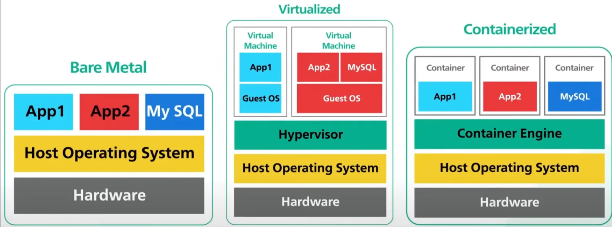

# Docker

## Czym jest docker?

Docker to narzędzie do tworzenia, dystrybucji i uruchamiania aplikacji w tzw. kontenerach. Kontener to lekka, przenośna jednostka, która zawiera aplikację wraz z całym jej środowiskiem – bibliotekami, zależnościami, systemem plików. Kontenery wraz z zawartością działają niezależnie od siebie i nie wiedzą o swoim istnieniu. Mogą się jednak ze sobą komunikować w ramach ściśle zdefiniowanych kanałów wymiany informacji. Konteneryzacja jest znacznie lżejszym sposobem uruchamiania aplikacji niż pełna wirtualizacja.

Strona projektu: https://www.docker.com/

Dokumentacja: https://docs.docker.com/

## Różne sposoby wirtualizacji

| Cecha | Bare-metal | Virtual Machine | Docker Container | Python Virtualenv |
|-----|------------|-----------------|------------------|-----------------|
| Izolacja | Brak | Pełny system operacyjny | Lekka (na poziomie procesu) | Tylko dependencies Pythona |
| Narzut zasobów | Brak | Duży (cały OS) | Niski (współdzielony kernel) | Minimalny |
| Czas uruchomienia | natychmiast | sekundy-minuty | milisekundy | natychmiast |
| Zakres izolacji | Pełny system | Cały system operacyjny | App + środowisko | Tylko Python |
| Przenośność środowiska | Niska | Średnia | Wysoka (obraz) | Niska |
| Użycie w produkcji | Nie | Czasem | Tak | Nie |



| Cecha | Bare Metal    | Virtual Machines (VMs) | Containers |
|-------|---------------|------------------------|------------|
| Opis | Fizyczny serwer z OS, uruchamiający aplikacje bez warstwy wirtualizacji | Wirtualna maszyna z własnym systemem operacyjnym | Samodzielna jednostka z aplikacją + zależności |
| Warstwa wirtualizacji | Brak (bezpośrednio na sprzęcie) | Hypervisor | Silnik kontenerowy (np. Docker) |
| Wydajność | ✅ Najwyższa – bezpośredni dostęp do sprzętu | ⚠️ Dobra, ale z narzutem przez hypervisor | ✅ Bardzo dobra – minimalny narzut |
| Izolacja | ✅ Przy jednej aplikacji ❌ Dla wielu aplikacji na jednym sprzęcie | ✅ Wysoka – każdy VM ma osobny OS i kernel | ⚠️ Umiarkowana – współdzielony kernel OS |
| Zarządzanie | ❌ Trudniejsze – fizyczna konserwacja, konfiguracja | ✅ Narzędzia do zarządzania VMs (np. Proxmox) | ✅ Łatwe – CI/CD, orchestracja (Docker, K8s) |
| Skalowalność | ❌ Ograniczona – wymaga nowych serwerów fizycznych | ✅ Dobra – szybkie tworzenie nowych VMs | ✅ Doskonała – natychmiastowe skalowanie |
| Elastyczność | ❌ Mała – zmiany wymagają rekonstrukcji OS/sprzętu | ✅ Wysoka – różne OSy i konfiguracje | ✅ Bardzo wysoka – łatwa migracja i przenośność |
| Bezpieczeństwo | ✅ Wysokie (przy jednej aplikacji na serwer)  ⚠️ Ograniczone (wiele aplikacji współdzieli system) | ✅ Wysokie – silna izolacja między VMs | ⚠️ Niższe – współdzielony kernel, możliwe luki w izolacji |
| Przenośność (portability) | ❌ Niska – zależność od sprzętu i OS | ⚠️ Umiarkowana – zależna od platformy hypervisora | ✅ Wysoka – kontener = uniwersalne środowisko uruch. |
| Typowe zastosowania | HPC, aplikacje z wysokimi wymaganiami sprzętowymi | Chmura prywatna/publiczna, legacy, systemy OS-specyficzne | Mikroserwisy, dev/test, aplikacje cloud-native (tworzone specjalnie z myślą o chmurze) |
| Największa zaleta | Wydajność + pełna kontrola nad sprzętem | Izolacja + elastyczność systemowa | Lekkość + przenośność + szybki czas wdrożenia |
| Największa wada | Brak elastyczności, problemy ze skalowaniem | Narzut wydajności + złożoność zarządzania | Bezpieczeństwo + złożone zarządzanie środowiskiem |

## Elementy dockera

* **image** (obraz) - niezmienny, samodzielny pakiet zawierający wszystko, co potrzebne do uruchomienia aplikacji: kod, zależności, konfigurację środowiska, itd. Obrazy są bazą do tworzenia kontenerów.

* **container** (kontener) - uruchomiona instancja obrazu. To izolowane środowisko działające niezależnie od systemu hosta. Kontener ma własny system plików, sieć, procesy, ale korzysta z jądra hosta. Możemy uruchomić kilka kontenerów na podstawie tego samego obrazu.

* **network** (sieć) - wirtualna sieć tworzona przez Dockera, umożliwiająca komunikację między kontenerami.

* **volume** -  trwały magazyn danych. Pozwala przechowywać dane poza kontenerem (np. pliki, bazy danych), tak aby nie zniknęły po jego usunięciu. Przydatne do backupów i pracy z danymi między restartami.

## Podstawowe komendy docker

```
docker pull <nazwa_obrazu>              # Pobiera obraz z rejestru
docker build -t <tag> .                 # Buduje obraz z Dockerfile z nadaniem nazwy
docker run -p 8080:80 <obraz>           # Uruchamia kontener z mapowaniem portów
docker ps                               # Pokazuje działające kontenery
docker stop <container_id>              # Zatrzymuje kontener
docker exec -it <nazwa_kontenera> bash  # interaktywna sesja wewnątrz kontenera
docker system prune -a                  # usuwanie wszystkich zasobów dockera
```

Dodatkowo, wiele operacji ma następującą konstrukcję:

```
docker <element> <komenda> <argumenty>
```

Na przykład:

```
docker container ls
docker container logs nginx
docker network rm example-network
```

Po więcej informacji wystarczy wpisać w bashu komendę `docker`.

## Dockerfile

Plik konfiguracyjny, który opisuje, jak zbudować obraz Dockera. Składnia jest prosta, oparta na komendach:

* **FROM** - definuje bazowy obraz
* **RUN** - wykonuje konkretne polecenie w trakcie nudowania obrazu (np. `apt-get update`)
* **COPY** - kopiuje pliki do obrazu
* **WORKDIR** - ustawianie katalogu roboczego
* **ENTRYPOINT** - definiuje co ma być wywołane przy starcie kontenera
* **CMD** - definiuje co ma być wywołane przy starcie kontenera; można natomiast tę komendę zastapić w trakcie uruchamiania kontenera przez `docker run <args>`.
* **EXPOSE** - definuje, które porty udostępnia obraz; nie jest wymagany nawet jeśli jakieś porty są otwarte; jest to raczej metadana obrazu

**CMD vs. ENTRYPOINT**

1. Używamy CMD

  ```
  CMD ["python", "app.py"]
  ```

  Wtedy:

  ```
  docker run myapp                 # uruchomi python app.py
  docker run myapp echo hello      # nadpisze CMD, uruchomi `echo hello`
  ```

2. Używamy ENTRYPOINT

  ```
  ENTRYPOINT ["python", "app.py"]
  ```

  Wtedy:

  ```
  docker run myapp                # uruchomi python app.py
  docker run myapp dev            # uruchomi python app.py z argumentem `dev`
  ```

## Budowanie i uruchamianie kontenera w praktyce

1. Przejdź do folderu `example`
2. Uruchom `docker build -t simple-website:v1 .`
3. Po wywołaniu `docker images` powinniśmy widzieć właśnie zbudowany obraz.
4. Uruchamiamy obraz mapując port 80 kontenera na port 8080 naszego komputera ``docker run -p 8080:80 simple-website:v1``.

**Dodatkowe parametry do uruchomienia kontenera**

```
docker run \
  --name my-website \                               # nadaje nazwę kontenerowi
  -p 8080:80 \                                      # mapowanie portów
  --network my-custom-network \                     # podłączenie kontenera do istniejacej sieci
  -v my-website-volume:/var/log/nginx  \            # montuje wolumen do ścieżki w kontenerze
  -v /home/user/css:/usr/share/nginx/css \          # montuje wolumen w konkretnym miejscu na dysku do ścieżki w kontenerze
  -e ENVIRONMENT=production \                       # ustawia zmienną środowiskową
  simple-website:v1
```

## Docker registry

Docker Registry to serwer, który przechowuje obrazy Dockera. Można go porównać do "repozytorium pakietów", ale dla całych środowisk/aplikacji zamkniętych w obrazach kontenerowych.

**Jak to działa?**

1. Budujesz obraz lokalnie (docker build)
2. Tagujesz go (docker tag)
3. Pushujesz do registry (docker push)
4. Inni (lub Ty sam) mogą go ściągnąć na innej maszynie (docker pull)

Przykładowe rejestry:

| Rodzaj | Opis |
|--------|------|
| Docker Hub | domyślne publiczne registry Dockera (https://hub.docker.com) |
| Azure Container Registry (ACR) | prywatne registry w chmurze Microsoft Azure |
| GitHub Container Registry (GHCR) | obrazy hostowane na GitHubie (ghcr.io) |
| Self-hosted Registry | możesz postawić własne registry (registry:2 jako kontener!) |

Python na Docker Hub: https://hub.docker.com/_/python

Tutorial o kontenerach na Azure: https://learn.microsoft.com/en-us/training/paths/az-204-implement-iaas-solutions/

## Dodatkowe narzędzia

1. Docker Compose
  * Docker Compose to narzędzie do definiowania i uruchamiania aplikacji złożonych z wielu kontenerów.
  * Konfiguracja w pliku docker-compose.yml (YAML)
  * Wszystkie usługi (np. frontend, backend, baza danych) uruchamiane jednym poleceniem
  * Przydatne na etapie lokalnego developmentu

  Przydatne komendy:
  ```
  docker compose up       # uruchomienie aplikacji
  docker compose down     # zatrzymanie i usunięcie kontenerów
  ```

2. Docker Swarm
  * Docker Swarm to system do tworzenia klastrów kontenerów – grupuje wiele maszyn w jedną logiczną całość.
  * Narzędzie jest wbudowane w dockera.

  Przydatne komendy:
  ```
  docker swarm init                  # uruchomienie trybu Swarm
  docker node ls                     # lista węzłów w klastrze
  docker service create nginx        # uruchomienie usługi
  docker swarm join-token worker     # generowanie tokena, który umożliwia podłączenie się workerów
  docker swarm join --token <token> 192.168.1.100:2377 # podłączenie workera do maszyny master
  ```

3. Kubernetes
  * Kubernetes (w skrócie: K8s) to zaawansowana platforma do zarządzania kontenerami w klastrze.
  * Automatyzuje deployment, skalowanie, load balancing
  * Obsługuje roll-outy, roll-backi, samonaprawianie usług
  * Używa własnych obiektów: Pod, Service, Deployment, itp.
  * Najmniejszą jednostką jest **Pod**. Zawiera on jeden lub więcej kontenerów, które współdzielą sieć i volumes. W praktyce najczęsciej 1 Pod = 1 kontener. Można dodatkowo określać jakie zasoby są przydzielane do każdego kontenera, a Kubernetes w sposób optymalny uruchomi kontenery na odpowiednich node'ach.

  Przydatne komendy:
  ```
  kubectl apply -f app.yaml       # uruchomienie aplikacji
  kubectl get pods                # sprawdzenie uruchomionych podów
  kubectl delete pod my-pod       # usunięcie poda
  kubeadm init                    # stworzenie node'a master
  kubeadm token create --print-join-command # generowanie tokeny na masterze
  kubeadm join 192.168.1.100:6443 --token ... --discovery-token-ca-cert-hash ... # podłączenie workera do mastera
  kubectl get nodes               # wylistowanie node'ów
  ```


## Rejestracja do darmowego dostępu do Azure dla studentów

https://azure.microsoft.com/en-us/free/students/?WT.mc_id=academic-0000-cxa

## Program do zarządzania dockerem

Portainer (https://hub.docker.com/r/portainer/portainer-ce) jest platformą, która pozwala na zarządzanie lokalną instancją dockera i wszystkimi jej elementami.

## Zadanie 

Przygotuj system trzech kontenerów w architekturze MVC (model-view-controler) połączonych w sieci Docker i uruchamianych przy pomocy `docker compose`. Początkowa struktura systemu znajduje się w folderze `mvc-task` w repozytorium.

System składa się z następujących elementów:
* model (baza danych) - obraz do ściągnięcia z Docker Hub; możliwość skorzystania z dowolnie wybranej bazy danych; w początkowej propozycji jest PostgreSQL (ale można ją zamienić na dowolną inną) oraz skrypt tworzący bazę danych `user_db` i jedną tabelę `people` z dostępem dla użytkownika `admin` i hasłem `password`.
* controler (kontroler) - serwer REST API z jednym endpointem do tworzenia nowych rekordów w bazie danych; początkowy schemat aplikacji jest napisany w Pythonie przy pomocy bilbioteki FastAPI; możecie użyć dowolnego języka: jedynym warunkiem jest to, że ma być co najmniej jeden endpoint do tworzenia nowych rekordów w bazie danych, która leży w oddzielnym kontenerze.
* view (widok) - prosta strona WWW wyświetlająca dane z bazy danych; poczatkowy schemat aplikacji proponuje użycie Pythona i biblioteki streamlit, ale nie jest to obowiązkowe; może to być dowolny język i dowolny pakiet.

Model działania:
1. Wstawiamy dane poprzez API (kontroler) do bazy danych, np. poprzez `curl -X 'POST' 'http://localhost:8000/people' -H 'Content-Type: application/json' -d '{"name": "Jan","surname": "Kowalski","position": "Intern","salary": 3000.00}'`
2. Dane lądują w bazie danych.
3. Tabelę z bazy danych (wszystkie dane) można zobaczyć w postaci tabeli w aplikacji webowej frontend.

UWAGA: Login i hasło do bazy danych muszą być podane jako zmienne środowiskowe (nie mogą być hard-codowane w kodzie aplikacji!).

UWAGA: W tym systemie dwa kontenery muszą być zbudowane poprzez Dockerfile: controler (api) oraz view (widok/frontend). Można je budować korzystając z sekcji `build` w pliku `docker-compose.yaml` (wtedy kontenery będą zbudowane w momencie uruchamiania `docker compose up`).

Całość ma być uruchamiana skryptem `docker-compose.yaml`.

Do przesłania:
* spakowany folder ze wszystkimi plikami i folderami (`docker-compose.yaml`, foldery `api`, `db`, `frontend`)
* screenshot frontendu, gdzie widoczne są dane w formie tabelki (Uwaga! Na zrzucie ekranu powinny być więcej niż dwa domyślne rekordy!)
