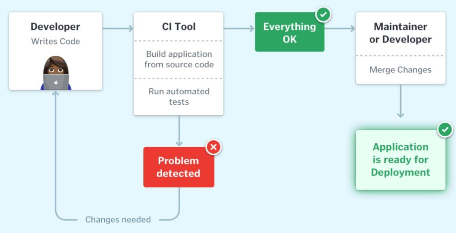
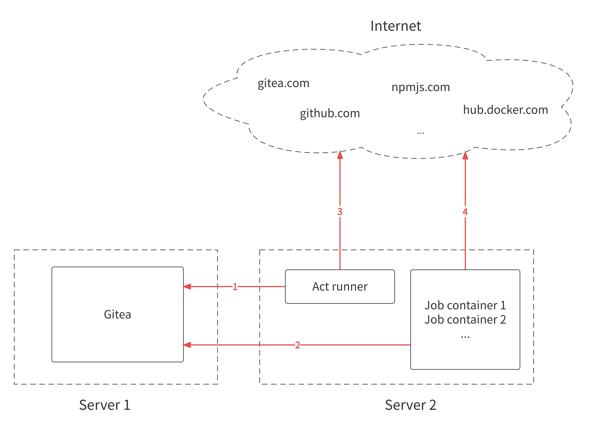

# CI/CD

## Czym jest CI/CD?

**CI/CD** = Continuous Integration + Continuous Delivery/Deployment

| 🧪 CI – *Continuous Integration*                           | 🚀 CD – *Continuous Delivery / Deployment*    |
| ---------------------------------------------------------- | ---------------------------------------------- |
| Automatyczne testowanie i budowanie kodu po każdej zmianie | Automatyczne wdrażanie aplikacji na środowiska |
| Sprawdza, czy zmiana nie psuje niczego                     | Umożliwia szybkie wypuszczanie nowych wersji   |
| Testy, build, analiza kodu                                 | Packaging, deploy i rollback                   |

🔧 Continuous Integration (CI)
* Programiści często integrują kod do wspólnego repozytorium (np. GitHub).
* Każdy commit uruchamia pipeline: budowanie, testy jednostkowe, analiza jakości (np. SonarQube).
* Celem jest szybkie wykrycie i naprawienie błędów.

🚀 Continuous Delivery (CD)
* Kod po testach trafia automatycznie na środowisko staging (zwykle podobne do produkcji).
* Dalsze testy (np. testy obciążeniowe).
* Gotowość do wypuszczenia na produkcję w każdej chwili, z ręcznym "zatwierdzeniem".

🤖 Continuous Deployment
* Każda zmiana, która przejdzie przez pipeline testów, trafia automatycznie na produkcyjne środowisko.
* Brak "manualnego zatwierdzenia" → potrzebne 100% zaufanie do testów automatycznych.

## Czym *w praktyce* jest CI/CD?

CI/CD to po prostu lista kroków (instrukcji), które komputer automatycznie wykonuje, np.:
1. 📥 Pobierz kod z repozytorium
2. 🛠 Zainstaluj zależności
3. 🐳 Zbuduj obraz Dockera
4. 🚀 Wdróż aplikację na środowisko testowe / produkcyjne

Wszystkie te kroki są zapisane np. w pliku .yml w GitHub Actions — i za każdym razem, gdy ktoś coś zmieni w kodzie, komputer "czyta" ten plan i go realizuje.

### Architektura działania Gitea Actions

Gitea to lekka, open-source'owa platforma DevOps – coś jak "własny GitHub", który możesz uruchomić na swoim serwerze.

Gitea Actions to system CI/CD wbudowany w Gitea, inspirowany i kompatybilny z GitHub Actions.
Każde uruchomienie workflow (pipeline’u) odbywa się wewnątrz kontenera Docker, nazywanego runnerem. Runnery mogą znajdować się na tym samym serwerze co serwer lub na zewnętrznych maszynach.

**Połączenie 1**

Runner łączy się do serwera Gitea, aby otrzymać zadania.

**Połączenie 2**

Job container łączy się do serwera Gitea, aby zaciągnąć kod (np. zadanie `actions/checkout@v4`).

**Połączenie 3**

Runner ściaga z Internetu definicje zadań (actions).

**Połączenie 4**

Job container ściaga dane z Internetu, np. instaluje paczki Pythonowe.

## Typowe elementy pipeline'u CI/CD

1. 🔔 Trigger – wyzwalacz, np. push lub pull request do konkretnego brancha
2. 📥 Checkout – pobranie repozytorium do przestrzeni roboczej
3. 🧰 Instalacja zależności – setup języka, bibliotek, narzędzi
4. 🧪 Testy jednostkowe – sprawdzenie, czy zmiany nie psują istniejącego kodu
5. 🔒 Skaner bezpieczeństwa – np. Snyk, Trivy, CodeQL
6. 🛠 Budowanie artefaktu – np. obraz Docker, paczka .zip, .jar, itp.
7. ☁️ Tworzenie infrastruktury – tworzenie zasobów chmurowych (np. serwery, bazy danych) z narzędziem typu IaC (np. Terraform)
8. 🚀 Deployment – wdrożenie na środowisko (testowe, staging, produkcyjne)
9. 📣 Powiadomienia – webhooki, e-maile, Slack/Discord/Teams — co poszło OK/nie-OK

## Dobre praktyki związane z CI/CD

### Branche w narzędziu git

| Gałąź       | Przeznaczenie           | CI/CD                                    |
| ----------- | ----------------------- | ---------------------------------------- |
| `feature/*` | Rozwój nowych funkcji   | CI (analiza kodu, testy)                 |
| `dev`       | Integracja i testowanie | CI + CD na środowisko *staging/dev*      |
| `main`      | Produkcja               | Pełny pipeline: testy + deploy na *prod* |

### Ustawienie tzw. *policies* dla repozytorium

Zasady te mogą wprowadzić zasady i ograniczyć pewnie działania w celu zachowania wysokiej jakości kodu, np. wymagane review przed mergowaniem PR, poprawność testów jednostkowych przed zatwierdzeniem PR, wdrażanie na *prod* tylko z main, zakazanie *force push*, itd.

### Zmienne środowiskowe i sekrety

W kodzie nie wolno trzymać żadnych kluczy i haseł hard-coded. Jeśli są one potrzebne w trakcie wykonywania pipeline'a, powinny zostać one zdefiniowane w Sekretach / Zmiennych repozytorium/organizacji. 

Na GitHubie ustawia się je w `Settings → Secrets and variables → Action`, a w pipeline odwołać się do nich jako `${{ secrets.AZURE_CREDENTIALS }}`. Można też grupować sekrety i zmienne w tzw. środowiska - w różnych środowiskach te same zmienne mogą mieć różne wartości.

Jeśli pewne sekrety są współdzielone w dedykowanych narzędziach (np. Azure Key Vault, Hashicorp Vault), w sekretach repo można trzymać dane potrzebne do zalogowania się do tych zasobów i bezpośrednio z nich wyciągać sekrety.

### Inne:

* Optymalizacja czasowa: równoległe uruchamianie pipeline'ów
* Definiowanie konkretnych wersji bibliotek i obrazów Dockera, aby mieć kontrolę w przypadku nowych wersji bazowych programów (np. nie ustawiać tagu `latest` w Dockerze)
* Monitoring przebiegu pipeline'ów (maile, alery, wiadomości, itp.)
* Wersjonowanie artefaktów, aby uniknąć problemów z identyfikowaniem, który artefakt został wdrożony w danym środowisku
* Rollback w przypadku nueudanego deploymentu

## Korzyści z CI/CD

| Korzyść                   | Opis                                                   |
| ------------------------- | ------------------------------------------------------ |
| 🧪 Wyższa jakość          | Błędy wychwytywane automatycznie przy każdym commicie  |
| ⚡ Szybsze releasy        | Aktualizacje dostępne częściej dla klientów            |
| 🔄 Mniej pracy ręcznej    | Automatyzacja eliminuje powtarzalne czynności          |
| 📉 Mniejsze ryzyko błędów | Małe zmiany = łatwiej je przetestować i cofnąć         |
| 🛡 Lepsze bezpieczeństwo  | Testy i skanery wykrywają podatności wcześniej         |
