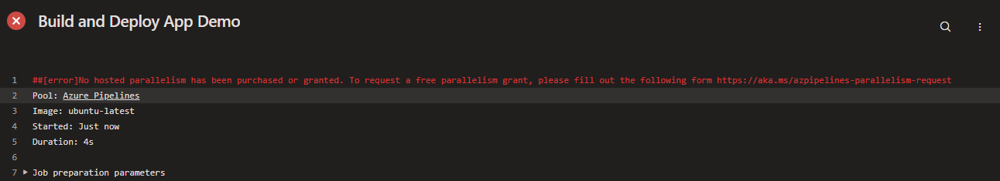

# Przykład

## GitHub

Aby skonfigurować pipeline, wystarczy wstawić pliki do folderu `.github/workflows`.

### GitHub Actions demo

```linenums="1"
--8<-- ".github/workflows/demo-ci-cd.yaml"
```

### GitHub Actions (MkDocs)

```linenums="1"
--8<-- ".github/workflows/mk-docs-gh-pages.yaml"
```

## Azure DevOps

Dwa sposoby:

* W Azure DevOps wybieramy po lewej stronie Pipelines -> New pipeline -> Wybieramy źródło kodu i ścieżkę do pliku konfiguracyjnego.
* W repozytorium klikamy Set up build -> Wybieramy ścieżkę do pliku konfiguracyjnego.

UWAGA! Przy pierwszym uruchomieniu pipeline'u pojawia się następujący komunikat: 



Aby go rozwiązać, trzeba wypełnić formularz pod podanym linkiem i poczekać **kilka dni**!

### Azure Pipelines demo

```linenums="1"
--8<-- "05-ci-cd/demo-ci-cd-azure.yaml"
```
