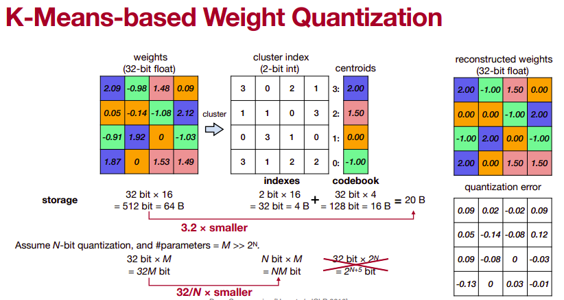
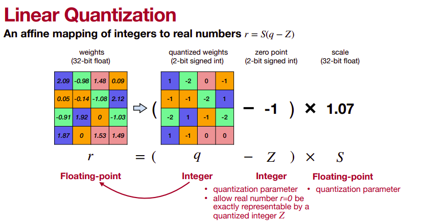
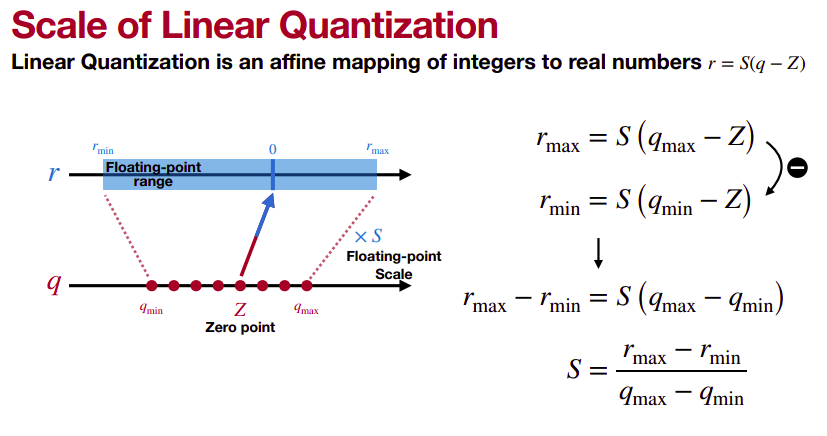

# Narzędzia ML

## AutoML

AutoML (Automated Machine Learning) to zestaw metod i narzędzi, których celem jest zautomatyzowanie procesu tworzenia modeli ML – od przygotowania danych po dobór algorytmu i jego strojenie. Dzięki temu osoby bez głębokiej wiedzy o ML mogą tworzyć modele o wysokiej jakości.

### Typowy cykl AutoML obejmuje:

| Etap  | Co się dzieje? |
| ----- | -------------- |
| Przygotowanie danych  | Czyszczenie, brakujące dane, skalowanie, kodowanie kategorii |
| Inżynieria cech   | Tworzenie nowych zmiennych (np. daty, interakcje) |
| Dobór modelu | Wybór algorytmu ML (np. Random Forest, SVM, itp.) |
| Strojenie parametrów | Optymalizacja hiperparametrów, walidacja krzyżowa (cross-validation) |
| Ensemble | Łączenie wielu modeli |
| Ewaluacja i selekcja | Testowanie i wybór najlepszego modelu |

### AutoSklearn

AutoSklearn to otwartoźródłowy framework AutoML w Pythonie oparty na scikit-learn.

Cechy:

* działa na danych tabelarycznych (np. klasyfikacja, regresja),
* automatyzuje przygotowanie danych, wybór modelu, tuning,
* używa technik:
    * Bayesian Optimization
    * Meta-learning
    * Ensemble construction

**Meta-learning**

Meta-learning pochodzi od *metadata learning*. AutoSklearn korzysta z bazy wiedzy o poprzednich zadaniach ML - posiada swój własny "meta-model", który wspomaga i skraca czas znalezienia optymalnego modelu.

🧠 "Jeśli wcześniej dane podobne do Twoich najlepiej działały z XGBoostem, to zacznę od XGBoosta."

**Bayesian Optimization**

Zamiast ślepo testować wszystkie kombinacje hiperparametrów, AutoSklearn inteligentnie wybiera kolejne eksperymenty, budując model przewidujący, które ustawienia mogą działać najlepiej.

🧠 "W poprzednich krokach najlepiej działały modele z n_estimators ~100 i max_depth ~5. Sprawdźmy w tej okolicy!"

**Ensembling**

AutoSklearn automatycznie łączy najlepsze modele w ensemble, co poprawia dokładność i stabilność.

### Zalety i wady

Zalety AutoML:

* Oszczędność czasu – bez ręcznego strojenia modeli
* Niższy próg wejścia – działa nawet dla początkujących
* Automatyczna optymalizacja – model często dorównuje ręcznie budowanym

Wady AutoML:

* Czarna skrzynka – nie wiadomo, co dokładnie robi model (problem interpretowalności)
* Ograniczona kontrola – trudniej dopasować model do specyficznego problemu
* Wydajność i koszt – potrafi być wolne i zasobożerne
* Nie zastępuje wiedzy domenowej – trzeba wiedzieć, co znaczą dane

## MLflow

MLflow to open-source'owa platforma do zarządzania całym cyklem życia modeli ML.
Jest ona język agnostyczna — wspiera Python, R, Java, REST API.
Ułatwia śledzenie eksperymentów, pakowanie modeli, wdrażanie i monitorowanie.

### Uruchomienie MLflow:

```bash
pip install mlflow
mlflow server --host 0.0.0.0 --port 5000 --backend-store-uri sqlite:///07-ml-tools/mlflow/mlflow.db --default-artifact-root 07-ml-tools/mlflow/mlruns
```

### Główne etapty cyklu życia modelu ML

1. Zbieranie i przygotowanie danych
2. Trenowanie modelu
3. Śledzenie eksperymentów (parametry, metryki, wyniki)
4. Pakowanie modeli do łatwego wdrożenia (np. konetener)
5. Wdrażanie modeli do produkcji
6. Monitorowanie modeli w działaniu (np. spadek jakości)

### Kluczowe komponenty MLflow

1. MLflow Tracking: logowanie i porównywanie eksperymentów (parametry, metryki, artefakty, wersje kodu).
2. MLflow Projects: standaryzowany sposób pakowania kodu do powtarzalnych eksperymentów.
3. MLflow Models: format pakowania modeli kompatybilny z różnymi platformami (TensorFlow, Spark, Scikit-learn).
4. MLflow Model Registry: centralne repozytorium modeli, wersjonowanie, kontrola etapów (np. staging, production).

### Podsumowanie

MLflow usprawnia cały proces od eksperymentu po produkcję.

Zapewnia lepszą reprodukowalność, skalowalność i kontrolę nad modelami.

Idealne narzędzie dla data scientistów i inżynierów ML do organizacji pracy i produkcyjnego wdrażania modeli.

## Kwantyzacja sieci neuronowych

Kwantyzacja to proces redukcji precyzji liczb zmiennoprzecinkowych (np. float32) do mniejszych formatów, takich jak int8. Stosuje się ją w celu:

* zmniejszenia rozmiaru modelu,
* przyspieszenia działania (inference),
* umożliwienia uruchamiania modeli na słabszym sprzęcie (CPU, edge, embedded).

Kiedy się ją stosuje?

* Po treningu (post-training quantization) – najprostszy wariant.
* W trakcie treningu (quantization-aware training) – dokładniejsze wyniki.
* Po treningu z fine-tuningiem – opcja pośrednia, z niewielką ilością dodatkowych danych.

Metody:

* K-Means Quantization - wagi z danej warstwy są klastrowane algorytmem k-means, a następnie zastępowane przez centroid.
* Linear Quantization - wagi z danej warstwy są skalowane liniowo i przybliżane do najbliższych elementów w skwantyzowanej przestrzeni.







Zalety kwantyzacji:

* znacznie mniejszy rozmiar modeli,
* szybsze przetwarzanie na CPU / edge devices (smartfony, PC, Raspberry Pi, specjalne układy jak Google Coral),
* niższe zużycie energii,
* możliwość działania na urządzeniach mobilnych,
* prywatność i bezpieczeństwo - dzięki mniejszym rozmiarom, dane mogą być przetwarzane lokalnie, bez potrzeby zewnątrznych dostawców.

Wady:

* możliwa utrata dokładności (jednak z zaawansowanymi technikami optymalizacyjnymi mogą to być zmiany rzędu kilka punktów procentowych w accuracy),
* bardziej skomplikowane debugowanie,
* czasem konieczny fine-tuning.

## Ollama: lokalne LLM

Ollama to narzędzie CLI i runtime do uruchamiania dużych modeli językowych (LLM) lokalnie – na lokalnym komputerze (CPU/GPU). Obsługuje zoptymalizowane modele w formacie GGUF, które pozwalają na szybkie i efektywne wnioskowanie bez potrzeby użycia chmury.

* Ułatwia pobieranie, uruchamianie i interakcję z modelami (np. Mistral, LLaMA, Gemma, Phi-3).
* Nie wymaga dodatkowego kodu czy frameworków.
* Działa na macOS, Windows, Linux.
* Pełni też funkcję serwera API i udostępnia udostępnia REST API do wysyłania zapytań - umożliwia integrację z frontendem, aplikacjami, bibliotekami takimi jak LangChain, LangGraph.

Instrukcja instalacji: [https://ollama.com/download/linux](https://ollama.com/download/linux)

Dostępne modele: [https://ollama.com/search](https://ollama.com/search)

LLM można odpalić lokalnie komendą:

```bash
ollama run llama3.2:latest
```
